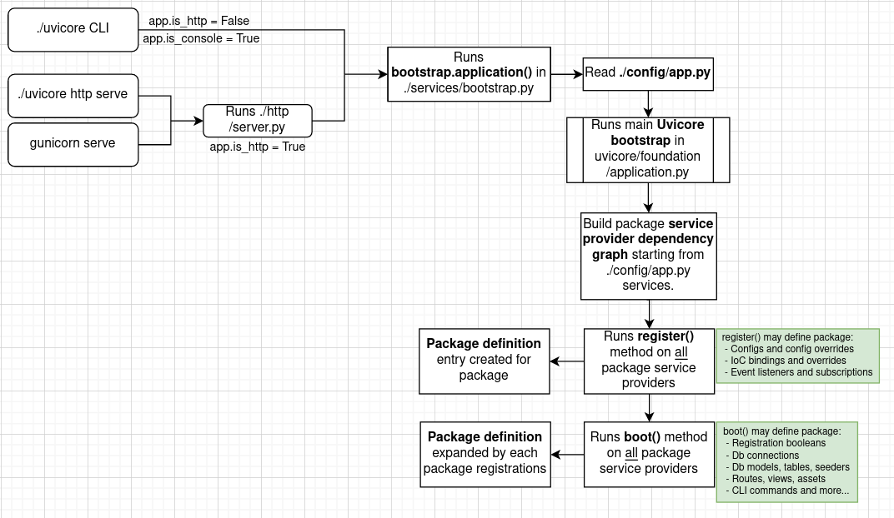

# Uvicore Bootstrap

!!! warning
    This section is for contributing developers of the uvicore source code.  Or for folks who just wish to learn how uvicore works under the hood!


## Bootstrap Diagram



!!! note "See The Code on Github"
    - [uvicore/__init__.py](https://github.com/uvicore/framework/blob/master/uvicore/__init__.py) — the pre-bootstrap entrypoint
    - [uvicore/foundation/application.py](https://github.com/uvicore/framework/blob/master/uvicore/foundation/application.py) — the `Application` and its three bootstrap phases
    - [uvicore/foundation/events/app.py](https://github.com/uvicore/framework/blob/master/uvicore/foundation/events/app.py) — the `Registered` and `Booted` lifecycle events

---

## Overview

Uvicore's bootstrap is a three-phase sequence that turns your application config into a fully wired, running framework.  Every package, service, route, model, command and event listener is registered and booted in a deliberate order so that a package's dependencies are always ready before the package itself needs them.

It all starts with a single call from your app's entrypoint:

```python
uvicore.bootstrap(app_config, path, is_console)
```

That call (in `uvicore/__init__.py`) initializes the IoC container, sets the earliest core globals (`uvicore.ioc`, `uvicore.app`, `uvicore.events`, `uvicore.jobs`), then hands off to `uvicore.app.bootstrap()`, which runs the three phases below and finishes by dispatching the `Booted` event.

!!! note
    Import order inside `uvicore.bootstrap()` is deliberate.  The IoC container is created from your `app_config` *before* `Application` and the event `Dispatcher` are imported, which is what lets your app override even the earliest core services.  Don't reorder it.

---

## Phase 1 — Build the Provider Graph

The first phase (`_build_provider_graph`) works out *which* packages need to load and *in what order*.

1. **Start from your `main` package** — The graph is seeded from `app_config.main`, a `Dict` holding your app's `package` and `provider` (and an optional custom `config` location).

2. **Walk the dependency tree** — Each package's `config/package.py` declares a `dependencies` dict of the packages it relies on.  Uvicore recurses into those dependencies (depth first) so every upstream package is discovered.

3. **Last provider wins** — If the same package is reached more than once (say two packages both depend on `uvicore.cache`), the later definition overwrites the earlier one, but because `self._providers` is an `OrderedDict` the original declaration *order* is preserved.  This is exactly how your app transparently overrides a framework package without upsetting dependency ordering.

4. **App overrides** — Finally, any `app_config.overrides.providers` you defined are recursed in last, so your app gets the final say on which provider wins.

The result is a flat, ordered `OrderedDict` of every provider, stored on `self._providers`.

---

## Phase 2 — Register All Providers

With the graph resolved, Uvicore (`_register_providers`) iterates every provider in order and calls its `register()` method.

For each provider it:

- Loads the package's `config/package.py` and builds a `Package` object (name, short name, vendor, version, path) into `self._packages`
- Instantiates the provider class
- Calls `provider.register()` — where lightweight IoC bindings and config merges happen

Once **every** provider has registered, Uvicore sets `self._registered = True` and dispatches the **`Registered`** event (`uvicore.foundation.events.app.Registered`).

!!! warning "register() runs before configs are fully merged"
    At this point the configuration system is not yet complete, so you have no reliable view of the final config.  Keep `register()` to config merges, lightweight IoC bindings and early event listeners only.  Note that `self.package` is deliberately `None` here — anything substantial belongs in `boot()`.

---

## Phase 3 — Boot All Providers

With every package registered and all configs deep-merged, Uvicore (`_boot_providers`) iterates the providers a second time and calls each `boot()` method.

For each provider it:

- Reloads the package's `config/package.py` (by now the global `uvicore.config` is fully deep-merged into one complete view)
- Instantiates a **fresh** provider instance — this time with its fully-built `Package` object passed in, which is why `self.package` *is* available in `boot()` but not in `register()`
- Calls `provider.boot()` — where the real wiring happens

Once **every** provider has booted, Uvicore sets `self._booted = True` and dispatches the **`Booted`** event (`uvicore.foundation.events.app.Booted`).

!!! tip "boot() is where everything happens"
    All configs are deep-merged and `self.package` is available.  Register database connections, models, tables, seeders, Web/API routes, views, assets and CLI commands here — everything substantial goes in `boot()`.

---

## Lifecycle Events

Two synchronous events mark the major bootstrap milestones.  They're the seam contributors reach for when code needs to run *after* every package has finished a phase — for example, inspecting the fully assembled route table once everything has booted.

| Event | Dispatched when | `is_async` |
|---|---|---|
| `uvicore.foundation.events.app.Registered` | After every `register()` has completed | `False` |
| `uvicore.foundation.events.app.Booted` | After every `boot()` has completed | `False` |

This is exactly how the HTTP, database and console subsystems bootstrap themselves — rather than forcing provider order, they simply **listen for the `Booted` event** and wire up once all configs are merged (see `uvicore/http/package/bootstrap.py`, `uvicore/database/package/bootstrap.py`).

---

## Console vs HTTP Mode

During bootstrap Uvicore decides whether it is running as a CLI or an HTTP app, exposed as `app.is_console`, `app.is_http` and `app.is_pytest`:

- **Console mode** (`is_console=True`) — CLI commands are registered; the HTTP server is not started.
- **HTTP mode** (`is_console=False`) — `is_http` is the inverse of `is_console`; the HTTP server takes over after bootstrap.
- **Pytest mode** — Auto-detected from the `PYTEST_CURRENT_TEST` environment variable.  Both console and HTTP modes are disabled and `is_pytest` is set.

A couple of sensible overrides apply:

- Running `./uvicore http serve` is technically a CLI command, but it needs the HTTP server live — so `command_is('http serve')` forces `is_console=False`.
- As a failsafe, if the `uvicore.http` package isn't in the provider graph at all, the app forces console mode so `http serve` can't half-start a server that doesn't exist.

---

## Globals Set During Bootstrap

Once bootstrap completes, these convenience globals are available on the `uvicore` module.  `ioc`, `app`, `events` and `jobs` are set immediately in `uvicore/__init__.py`; the rest are populated by their respective package providers as they boot.

| Global | Service |
|---|---|
| `uvicore.ioc` | The IoC container |
| `uvicore.app` | The Application singleton |
| `uvicore.events` | The Event dispatcher |
| `uvicore.jobs` | The Job dispatcher |
| `uvicore.config` | The merged configuration SuperDict |
| `uvicore.log` | The Logger |
| `uvicore.db` | The Database manager |
| `uvicore.cache` | The Cache manager |

---

## Performance Counter

The `Application` carries a small debug helper, `app.perf(item)`.  When `app.debug` is enabled it appends `item` to `app.perfs` and prints it; when debug is off it does nothing.  It's a lightweight hook for instrumenting a bootstrap you're debugging — drop `app.perf(...)` calls into the flow and read the collected list back from `app.perfs`.

!!! tip "Bootstrap tips"
    - Three phases, always in this order: **build the graph → register everyone → boot everyone**.
    - `register()` sees an incomplete config and no `self.package`; `boot()` sees the fully merged config and a real `self.package`.
    - Need to run after *all* packages finish a phase?  Listen for the `Registered` or `Booted` event instead of fighting provider order.
