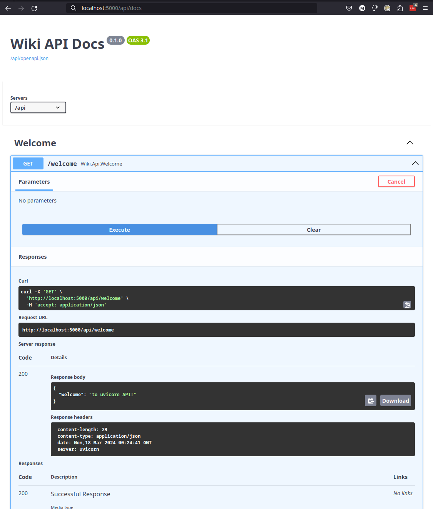
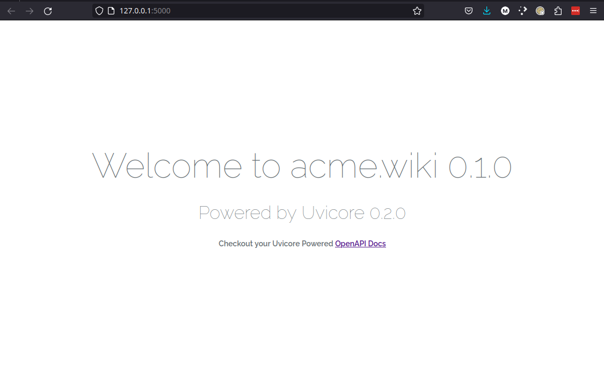

---
# DOC STATUS
# ------------------------------------------------------------------------------
# 100% done
# Looking good!
# ------------------------------------------------------------------------------
title: Uvicore - Fullstack Async Python
hide:
  - navigation
---

<style>
    /* Hide all heading1 elements */
    .md-content .md-typeset h1 {
        display: none;
    }

    /* Make title bold like all other pages */
    .md-header__title {
        font-weight: bold;
    }

</style>


!!! note ""
    <div class="page-title" align="center">
        Feature Packed!
    </div>
    <div class="page-slogan" align="center">
        Uvicore is packed with full stack features.  Batteries included out of the box!
    </div>


## :material-pound: Full Stack

<div class="section-slogan" align="center">
" Just get coding with Uvicore and deliver results! "
</div>

Micro frameworks like Flask, Starlette and FastAPI are **awesome!!!**  So why should you care about  a Full Stack framework like Uvicore?

Have you ever tried to use a micro framework in a small to medium size project?  How does it end for you? My experience shows that you end up building your own larger framework in the end.  Here is what I mean:

- You start with FastAPI and build a '/hello-world' endpoint.  Awesome, you're a pro!
- Then you need to talk to MySQL, PostgreSQL, SQLite for testing, MSSQL etc...
- So you install and hack up a SQLAlchemy connection...somewhere in your folder structure?  Where?
- Then you realize that a `wkr` benchmark shows SQLAlchemy blocking all your connections...suddenly FastAPI isn't so fast!
- So you install `encode/databases` to add async to your SQL connections, great!
- Now you have a dozen SQL tables and models + pydantic models.  What does your folder structure look like?
- You quickly realize that you need redis caching to optimize user results.
- After sifting through the dozen redis libraries you finally integrate a good async solution!
- Now you want to raise events and subscribe to those events, you need an event driven architecture, is there a library for that?
- You realize that if you make a second app there is common functionality you want repeated, so you make a `foundation` or a `framework` shared python library for both `app1` and `app2`.
- You quickly realize `app1` and `app2` have slightly different needs and require the `framework` bend to your apps will, you quickly discover the need for `Inversion of Control` and complex `Dependency Injection`.
- With a complex framework with dozens of modules, how do you build a complex and deep-merged configuration system?
- **... on and on it goes ...** until it runs away from you and you are lost in complexity.

In the end, what do you have?  A custom built framework with an unwieldy folder structure, hacked up from a dozen libraries.  A framework that you now have to support forever!  A framework that no one else knows except you.  Something non-standard and most likely, unsupported by future developers.  They'll just re-write it anyway.

Starting with a micro framework usually ends up with you building and supporting a full stack framework in the end.  Micro frameworks are one small cog in the greater machine, a means to and end.  The end, is almost always a larger more complex framework!

Building frameworks is hard and requires a great deal of forethought.  Framework design is a craft and takes a lot of time to master.

The developers of Uvicore have focused their 20 year's of experience on building large and complex frameworks.

**Let Uvicore be your standardized full stack framework, and stop struggling with building the entire world yourself!**

---


## :material-pound: Dual Routers

<div class="section-slogan" align="center">
" Robust OpenAPI/Swagger Routes and/or Jinja2 Templated Web Routes "
</div>

Uvicore provides a blazing fast asynchronous dual routing engine based on **FastAPI** for API/Swagger endpoints and **Starlette** for Jinja2 templated MVC routes!

### :material-pound: :material-pound: API Router

These days, most backend systems simply provide RESTful APIs leaving the Frontend up to SPA frameworks like Angular, React and Vue.js.

Uvicore abstracts **FastAPI** into an elegant `./http/routes/api.py` routes file
```python
@uvicore.routes()
class Api(Routes):
    def register(self, route: ApiRouter):
        """Register API Route Endpoints"""

        # Define controller base path
        route.controllers = 'acme.wiki.http.api'

        # Public Routes
        route.controller('welcome')

        # Include dynamic model CRUD API endpoints (the "auto API")!
        # These routes are automatically protected by model.crud style permissions.
        route.include(ModelRouter, options=uvicore.config.app.api.auto_api)
```

With simple and beautiful `./http/api/*` API controllers
```python
@uvicore.controller()
class Welcome(Controller):
    def register(self, route: ApiRouter):

        @route.get('/welcome', tags=['Welcome'])
        async def welcome():
            return {'welcome': 'to uvicore API!'}
```

Which produce instant OpenAPI/Swagger Docs!



### :material-pound: :material-pound: Web Router

Standard **server-side** postback web routes are still in style!  Uvicore provides Jinja2 templated web routes for traditional style website building.

The beauty of traditional web development is a single unified language...python!  Sprinkle in a little Javascript via jQuery, Alpine.js or Vue.js and you have a simple and rapid web application without the complexity of a large SPA like Angular or React.  Choice is yours!

Leverage the tried and true server-side postback `MVC` pattern of web development with your `./http/routes/web.py` router
```python
@uvicore.routes()
class Web(Routes):
    def register(self, route: WebRouter):
        """Register Web Route Endpoints"""

        # Define controller base path
        route.controllers = 'acme.wiki.http.controllers'

        # Public Routes
        route.controller('welcome')
```

And the familiar web controllers in `./http/controllers/*`
```python
@uvicore.controller()
class Welcome(Controller):
    def register(self, route: WebRouter):

        @route.get('/', name='welcome')
        async def welcome(request: Request):
            me = uvicore.app.package(main=True)
            api_config = uvicore.config.app.api
            return await response.View('wiki/welcome.j2', {
                'request': request,
                'app_name': me.name,
            })
```

Along with your server side rendered Jinja2 templates in `./http/views/*`
```python
<!DOCTYPE html>
<html lang="en">
<body>
    <div class="title">
        Welcome to {{app_name}}
    </div>
</body>
</html>
```


---


## :material-pound: Modular Packages


<div class="section-slogan" align="center">
" There is no Shell "
</div>


If you have ever coded in Django, Laravel, Symfony or other full stack frameworks they often provide the concept of **packages** or **bundles** as a way to extend your application.  What they all have in common is that they all require you run a Laravel/Django/Symfony **shell** or "server".  So your package/bundle requires some other shell to be ran/served which hosts your package.

Uvicore believes that when you create a **package**, that package should be standalong, meaning you can **serve** your package without a shall.  BUT you can also include your package inside another package as a dependent "library".  In other words, packages ARE apps, and any app can be a library included inside another running app!


<div class="section-slogan" align="center">
" Override Everything "
</div>

If your app includes other Uvicore packages (as dependent libraries), your app may with to override package configs, views, routes and any other method/class.


- Apps are modules
- Modules are apps
- Deep overriding of packages configs, routes, assets, views etc...

---


## :material-pound: Inversion of Control

:material-auto-fix: Content Coming Soon...

---


## :material-pound: Custom ORM

:material-auto-fix: Content Coming Soon...

---


## :material-pound: Automatic Model Router

:material-auto-fix: Content Coming Soon...

---


## :material-pound: Schematic Generators

:material-auto-fix: Content Coming Soon...

---
