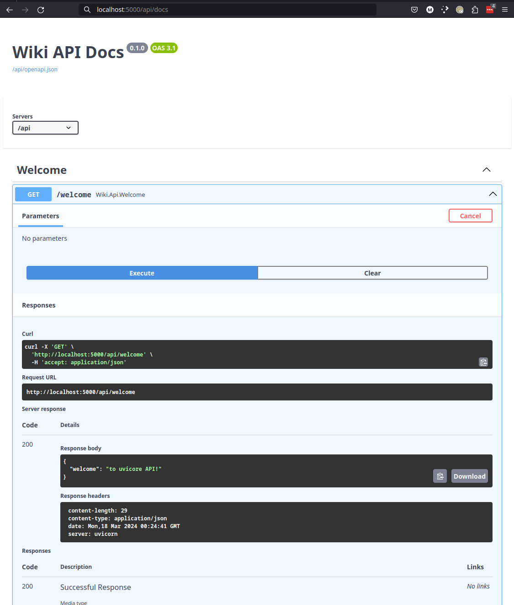
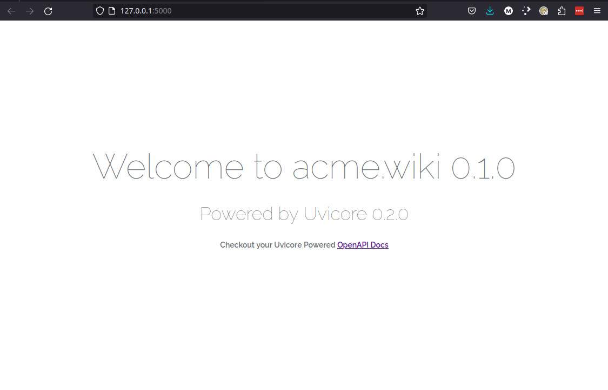

---
# DOC STATUS
# ------------------------------------------------------------------------------
# 100% done
# Looking good!
# ------------------------------------------------------------------------------
title: Uvicore - Fullstack Async Python
hide:
  - navigation
---

<style>
    /* Hide all heading1 elements */
    .md-content .md-typeset h1 {
        display: none;
    }

    /* Make title bold like all other pages */
    .md-header__title {
        font-weight: bold;
    }

</style>


!!! note ""
    <div class="page-title" align="center">
        Feature Packed!
    </div>
    <div class="page-slogan" align="center">
        Everything you need to build production-grade async Python applications.<br>
        Batteries included. Zero compromises.
    </div>


## Full Stack

<div class="section-slogan" align="center">
" Stop building a framework. Start building your product. "
</div>

Micro frameworks like Flask, Starlette, and FastAPI are **genuinely great** starting points.  But here's the dirty secret no one talks about: for any real project, they're just the starting gun.

Sound familiar?

- You start with FastAPI and nail a `/hello-world` endpoint.  You're flying!
- Then you need MySQL, PostgreSQL, SQLite for tests, and maybe MSSQL down the road.
- You hack in SQLAlchemy... somewhere.  But `wrk` benchmarks reveal it's blocking your event loop.  FastAPI isn't so fast anymore.
- You layer in `encode/databases` for async SQL.  A dozen tables grow to fifty.  Your `models/` folder becomes a graveyard of disconnected Pydantic schemas.
- You add Redis caching.  Then an event bus.  Then a second app that needs to share code from the first.
- Now you're writing a **shared foundation library** just to survive.  Then suddenly you need Inversion of Control so `app2` can override `app1`'s defaults.  Then a deep-merge config system so each app can tune shared settings without blowing up the other.
- **... and on it goes ...** until the "quick API" you started has become a sprawling, undocumented, bespoke framework that only you understand.

In the end you have a custom framework stitched together from a dozen libraries, with no standard structure, no community knowledge, and a new developer's worst nightmare to onboard into.

**Building frameworks is a craft.**  It takes years of hard-won experience in systems design, dependency management, and architectural foresight to get right.  The Uvicore developers have spent **20+ years** building and maintaining large-scale production frameworks before a single line of Uvicore was ever written.

That experience lives in every corner of this framework.

**Let Uvicore carry that weight so you can focus on what actually matters: shipping your product.**

---


## Dual Routers

<div class="section-slogan" align="center">
" One framework. Two routing engines. Every use case covered. "
</div>

Modern Python backends come in two flavors: pure REST APIs feeding a JavaScript SPA, and traditional server-rendered web apps.  Most frameworks force you to choose one or build two separate projects.  **Uvicore ships both, fully integrated, side by side.**

### API Router

Your JSON API layer runs on **FastAPI** — the fastest Python async API framework available — wrapped in Uvicore's elegant package and provider system.  Routes are clean, controllers are simple, and every endpoint gets **automatic OpenAPI/Swagger documentation** with zero extra work.

```python title="http/routes/api.py"
@uvicore.routes()
class Api(Routes):
    def register(self, route: ApiRouter):
        route.controllers = 'acme.wiki.http.api'
        route.controller('welcome')

        # One line activates full CRUD endpoints for every registered model
        route.include(ModelRouter, options=uvicore.config.app.api.auto_api)
```

```python title="http/api/welcome.py"
@uvicore.controller()
class Welcome(Controller):
    def register(self, route: ApiRouter):

        @route.get('/welcome', tags=['Welcome'])
        async def welcome():
            return {'welcome': 'to uvicore API!'}
```

Instant, beautiful Swagger docs — no annotations, no YAML, no pain:



### Web Router

Server-rendered web apps aren't going anywhere.  Uvicore's **Starlette-powered web router** gives you a full MVC pattern with Jinja2 templating.  Build traditional websites, internal dashboards, or admin panels — all in pure Python, with optional Alpine.js, Vue, or jQuery for interactivity.

One language.  One codebase.  No JavaScript build pipeline required.

```python title="http/routes/web.py"
@uvicore.routes()
class Web(Routes):
    def register(self, route: WebRouter):
        route.controllers = 'acme.wiki.http.controllers'
        route.controller('welcome')
```

```python title="http/controllers/welcome.py"
@uvicore.controller()
class Welcome(Controller):
    def register(self, route: WebRouter):

        @route.get('/', name='welcome')
        async def welcome(request: Request):
            me = uvicore.app.package(main=True)
            return await response.View('wiki/welcome.j2', {
                'request': request,
                'app_name': me.name,
            })
```

```html title="http/views/wiki/welcome.j2"
<!DOCTYPE html>
<html lang="en">
<body>
    <h1>Welcome to {{ app_name }}</h1>
</body>
</html>
```



Both routers share the same authentication, middleware, and provider wiring.  There's no split brain — it's one unified framework running two engines simultaneously.

---


## Modular Packages

<div class="section-slogan" align="center">
" Every package is a standalone app. Every app is a composable package. "
</div>

Django has apps.  Laravel has bundles.  Symfony has components.  They all share the same fatal flaw: **your code can only live inside their shell.**  You run Django.  Django hosts your app.  You're a guest in someone else's house.

Uvicore flips this completely.

In Uvicore, **every package is also a fully runnable application**.  Your `acme.wiki` package can be served on its own as a standalone HTTP + CLI app.  But it can also be imported as a silent library dependency inside `acme.portal`, which runs the show.  No shell required.  No host process needed.  Your package *is* the process.

```
acme.portal  (running app)
  └── acme.wiki    (imported as a library)
  └── acme.auth    (imported as a library)
  └── uvicore.auth (imported as a library)
```

Each layer in that stack has its own:

- **Config** — registered under its own key, deeply merged at boot time
- **Database connections and models** — each package manages its own schema
- **HTTP routes and controllers** — mounted into the unified server automatically
- **CLI commands** — all commands from all packages appear in one `./uvicore` CLI
- **Views and asset paths** — merged into the templating engine automatically
- **Event listeners** — each package can listen to events fired by any other

### Deep Override

When your running app includes another package as a library, it has **full authority to override anything** that package exposes.  Configs, views, routes, any class or binding — all of it can be silently replaced by a consuming app without modifying the library's source.

```
acme.portal overrides:
  ✔ acme.wiki config values (granular key-level deep merge)
  ✔ acme.wiki Jinja2 templates (drop-in template path override)
  ✔ uvicore.auth User model (swap the entire class via IoC)
```

The **last provider registered wins**.  Define your overrides in your app's provider, and they silently take precedence over every dependency beneath you — including the Uvicore framework itself.

This is true modularity.  Not plugins bolted onto a host.  Not monoliths split into folders.  Independently deployable packages that compose cleanly into larger systems, with full override authority at every layer.

---


## Inversion of Control

<div class="section-slogan" align="center">
" Override anything. Even the framework itself. "
</div>

Most frameworks hand you a toolkit and say *"here's what you get."*  When something doesn't fit, you're left monkey-patching internals, subclassing five levels deep, or filing a GitHub issue and waiting.

Uvicore was designed from day one on a different principle: **everything is swappable.**

Every major class in the framework — the HTTP server, ORM engine, configuration system, auth handler, cache driver, query builder — is registered in the **IoC container** as a named binding.  Your app config can silently replace any of them with your own implementation.  No patching.  No tricks.  Just a clean declarative override applied at boot time before anything runs.

```python
# config/overrides.py — swap core framework internals cleanly
overrides = {
    'uvicore.orm.query.OrmQueryBuilder': 'myapp.orm.CustomQueryBuilder',
    'uvicore.auth.user.User':            'myapp.models.user.User',
    'uvicore.cache.cache.Cache':         'myapp.cache.RedisClusterCache',
}
```

The container supports **singletons**, **transient bindings**, and **make-on-demand** resolution.  Singletons are shared across the entire application lifetime.  Transients are freshly created on every `make()` call.  You choose the lifecycle that fits the dependency.

```python
# Resolve anything from anywhere — always gets the correct concrete implementation
user_repo = uvicore.ioc.make('UserRepository')
cache      = uvicore.ioc.make('Cache')
config     = uvicore.ioc.make('Config')
```

IoC also powers the **package override system**.  When `acme.portal` imports `acme.wiki`, the portal's provider loads last and wins.  Its IoC bindings silently replace the wiki's defaults.  Users of `acme.portal` get the portal's customized behavior without touching a line of wiki code.

This isn't dependency injection bolted on as an afterthought.  It's the architectural backbone of the entire framework — and it puts **you in control**, not the framework.

---


## Custom ORM

<div class="section-slogan" align="center">
" One model for app logic + API schema. One table class for SQL precision. Perfectly wired together. "
</div>

Most Python stacks force you to maintain disconnected pieces that drift:

1. SQLAlchemy table definitions
2. ORM model logic
3. Pydantic/OpenAPI response schemas

Uvicore takes a smarter approach that keeps power and clarity:

- Your `@uvicore.model()` class unifies **ORM behavior + Pydantic/OpenAPI schema** in one place
- Your SQLAlchemy table remains a dedicated `@uvicore.table()` class for explicit database structure and connection control
- The model links to the table with `__tableclass__`, so both layers stay intentionally connected

This gives you the best of both worlds: rich model ergonomics for application code, plus explicit SQL table control when you need database-level precision.

```python
# app1/models/post.py
@uvicore.model()
class Post(Model['Post'], metaclass=ModelMetaclass):
    """App1 Posts"""

    # Wire model to SQLAlchemy table class
    __tableclass__ = table.Posts

    id: Optional[int] = Field('post_id', primary=True, read_only=True)
    slug: str = Field('post_slug', max_length=255)
    title: str = Field('post_title')
    body: str = Field('post_body')
    creatorId: int = Field('creator_id')

    # Relations are part of the same model schema and API docs
    # These relations are what drives Uvicore's automatic model API router!
    creator: Optional[User] = Field(None, relation=BelongsTo('uvicore.auth.models.user.User'))
    tags: Optional[List[Tag]] = Field(None, relation=BelongsToMany('app1.models.tag.Tag', join_tablename='post_tags', left_key='post_id', right_key='tag_id'))

```

```python
# app1/database/tables/posts.py
@uvicore.table()
class Posts(Table):
    name = 'posts'
    connection = 'app1'

    schema = [
        sa.Column('post_id', sa.Integer, primary_key=True),
        sa.Column('post_slug', sa.String(length=100), unique=True),
        sa.Column('post_title', sa.String(length=100)),
        sa.Column('post_body', sa.Text()),
        sa.Column('creator_user_id', sa.Integer, sa.ForeignKey(f"{users}.id"), nullable=False),
    ]

```

The **fluent async query builder** makes complex queries readable without writing SQL:

```python
posts = await Post.query() \
    .include('creator', 'tags') \
    .where('creator_id', user.id) \
    .order_by('created_at', 'desc') \
    .limit(10) \
    .get()
```

**Lifecycle hooks** let you cleanly react to data changes — auto-slug generation, audit logging, cache invalidation — without polluting your controllers:

```python
async def _before_save(self):
    self.slug = slugify(self.title)

async def _after_insert(self):
    await event.dispatch('post.created', self)
```

And every ORM operation — insert, update, save, delete — automatically fires **named string events** that any listener anywhere in your app or a dependent package can subscribe to.  Your data layer becomes a live event bus with zero extra wiring.

Result: cleaner architecture, less duplication, and a model layer that stays fast to work with as your project grows.

---


## Automatic Model Router

<div class="section-slogan" align="center">
" Full CRUD API for every model. Instant OpenAPI docs. Zero boilerplate. "
</div>

You've seen it a hundred times.  Every new model means another round of copy-paste:
`GET /<entity>`, `GET /<entity>/{id}`, `POST /<entity>`, `PUT /<entity>/{id}`, `DELETE /<entity>/{id}`.
Then wire up permissions.  Then add the response models to Swagger.  Then do it again for the next model.

**Uvicore's Model Router makes all of that disappear.**

One line in your routes file.  Every registered ORM model gets a fully functional, permission-protected, OpenAPI-documented REST API — generated live at boot time, always in sync with your models.

```python title="http/routes/api.py"
@uvicore.routes()
class Api(Routes):
    def register(self, route: ApiRouter):
        route.controller('welcome')

        # One line. Every model. Full CRUD. Built-in auth. Live Swagger docs.
        route.include(ModelRouter, options=uvicore.config.app.api.auto_api)
```

For every included model, Uvicore generates and secures all seven standard endpoints automatically:

| Method | Endpoint | Required Permission |
|--------|----------|---------------------|
| `GET` | `/<model>` | `<model>.read` |
| `GET` | `/<model>/{id}` | `<model>.read` |
| `POST` | `/<model>` | `<model>.create` |
| `POST` | `/<model>/with_relations` | `<model>.create` |
| `PUT` | `/<model>/{id}` | `<model>.update` |
| `PATCH` | `/<model>/{id}` | `<model>.update` |
| `DELETE` | `/<model>/{id}` | `<model>.delete` |

Permissions are **derived automatically from the model's table name** and enforced on every request.  Not a single line of auth code in your controllers.

Fine-tune which models are exposed with glob-style include/exclude patterns:

```python
'auto_api': {
    'include': ['myapp.models.*'],
    'exclude': ['*.models.internal_audit.*'],
}
```

This is **not a code generator**.  There are no files to maintain, no output to keep in sync.  The Model Router runs at boot time — dynamic, live, and always perfectly reflecting the current state of your models.  Ship a new model, add it to the include list, and the API is live on the next restart.

---


## Schematic Generators

<div class="section-slogan" align="center">
" One command. Correct file. Right folder. Proper naming. Every time. "
</div>

Every new feature in a well-structured project means creating several files, naming them correctly, placing them in the right directories, and wiring the right imports.  Get any of that wrong and you're debugging structure instead of writing features.

Uvicore's **`gen` CLI** does all of it for you in one command.  Not toy stubs you have to gut and rewrite — production-quality schematics that drop into your project ready to wire up and run.

```bash
./uvicore gen command  process_invoices   # New CLI command
./uvicore gen table    invoices           # Database table definition
./uvicore gen model    invoice invoices   # ORM model linked to that table
./uvicore gen seeder   invoices invoice   # Database seeder for test/demo data
./uvicore gen controller      invoice     # Server-rendered web controller
./uvicore gen api_controller  invoice     # REST API controller
```

Every generator is **package-aware**.  It reads your running app's configured folder structure and places files in exactly the right location — even in multi-package monorepo setups where packages have custom directory layouts.

Generated files include:

- **Correct imports** — no hunting for the right module path
- **Correct class names** — StudlyCase from snake_case automatically
- **Correct file names** — placed under the right sub-directory with the right name
- **Working skeleton** — each file has the methods and decorators needed to be immediately registered and run

Add a model, register it in your provider, and you're querying a real database in minutes.  Add an API controller, register the route, and you're handling requests.  The scaffolding never gets in your way — it just eliminates the tedium so you can focus on the logic that matters.

**Stop writing boilerplate.  Start writing features.**

---
