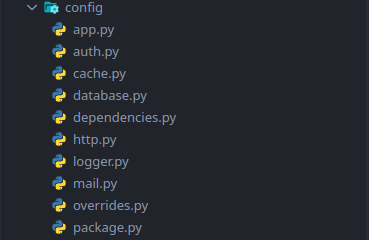

# Configuration


## :material-pound: Structure

All Uvicore packages contain their own configuration in the `config` directory.



According to Uvicore's [Modular Concept](/deeper/modular/), a package can be either an app (something that is "running") or a library (something that is "imported" by another running app).

When your package is "running" as an app (ie: `./uvicore/http serve`), the `config/app.py` tells the app how to run.  Which HTTP server port to use, OpenAPI urls and titles, what middleware to use for the entire app etc...

But when your packages is imported as a library inside someone elses app, the `config/package.py` is used.  The consuming app is already governing its own app config thus has no need for your packages app config.  But when your library is imported, it has its own configs despite what the running app says.  Configs like what package registrations and paths, the database and redis connections required by the package and any other package specific settings.

Because of this concept, be sure that package specific configs, despite which "app" is running, stay inside the `config/package.py` file.  This is where your custom configs...those required to make your package function, should live.

---


## :material-pound: Registering Configs

All packages register their own configs using a unique `key`, generally your apps name.  This
registration is done inside the [Package Provider](/deeper/provider/) in the `register()` method.

If a config is already registered with the same `key` then the Dictionary value
will be `deep merged`.  This allows packages to override other package configs
at a granular level.  The last provider defined wins.

```python
@uvicore.provider()
class Myapp(Provider, Cli):

    def register(self) -> None:
        # Register configs
        # If config key already exists items will be deep merged allowing
        # you to override granular aspects of other package configs
        self.configs([
            # Here self.name is your packages name (ie: acme.wiki).
            {'key': self.name, 'value': self.package_config},

            # Example of how to override another packages config with your own.
            #{'key': 'uvicore.auth', 'module': 'acme.wiki.config.overrides.auth.config'},
        ])
```

---


## :material-pound: Getting a Config Instance

You can get hold of the main config instance (a singleton containing a deep merge of all packages configs) in many different ways.

By importing the `uvicore` module as a namespace and accessing the config global
variable
```python
import uvicore
uvicore.config('app.name')
uvicore.config('acme.wiki.version')
```

By importing the `uvicore.config` global variable directly
```python
from uvicore import config
config('app.name')
config('acme.wiki.version')
```

By `making` from the Ioc container
```python
import uvicore
config = uvicore.ioc.make('config')  # Other aliases: Configuration, Config
config('app.name')
config('acme.wiki.version')
```

By using the proper package.  Some classes have the current package as `self.package`.
Or you can find your package from the `uvicore.app.package` method.
```python
import uvicore
package = uvicore.app.package('acme/wiki')
package.config('version')
```


---


## :material-pound: Usage

!!! info
    `config` is a class with a `__call__` method so you can use the class like a
    method `config('app.name')`.  This is provided as a convenience.
    Under the hood the `__call__` simply calls a `dotget()` method.  Technically you
    can also get config values by using this `dotget()` method like so
    `config.dotget('app.name')`.

    Config is also a uvicore [SuperDict](/deeper/superdict/)!.  This means you can use method style dot notation
    to access the entire nested config structure like `config.app.cache`.


### :material-pound: :material-pound: Getting Values

!!! notice
    The config system is a large [SuperDict](/deeper/superdict/).  One of the main differences of a [SuperDict](/deeper/superdict/) is that keys that do not exist to not return `None`, they return an empty `SuperDict({})` which allows method style chaining to work properly.  So never check `if config.connections is None` as it will never be none.  Instead just check `if config.connection`.  This also means that `hasattr(config, 'somekey')` will ALWAYS return True even if the key does not exist because it default to `SuperDict({})`.


Get the entire config Dictionary from all packages, completely deep merged based
on provider order override
```python
config
# or
config()
```

!!! warning
    Do not use `.get()`.  Since the config system is essentially a large uvicore [SuperDict](/deeper/superdict/) using `.get()` is actually a standard python Dictionary `.get()`.  So `.get('onelevel')` does work as it would on any dictionary, but `.get('onelevel.twolevel')` will not.  This is why the `.dotget()` method exists.  Or just use method style dot notation because its a class like SuperDict! (ex: `config.onelevel.twolevel`).


Get the main `app config` which is defined in the main running app
`config/app.py` file.  This main app config is not deep merged as it is the only
running app config.
```python
config.app
# or
config('app')
# or
config.dotget('app')
# or
config['app']
```

Get a value from the app config
```python
config.app.name
# or
config('app.name')
# or
config.dotget('app.name')
# or
config['app']['name']
```

Get the entire config for a package named `acme.wiki` and get a few single
values.
```python
config.acme.wiki.database.connections
# or
config('acme.wiki.database.connections')
# or
config.dotget('acme.wiki.database.connections')
# or
config['acme']['wiki']['database']['connections']
```

### :material-pound: :material-pound: Settings Values

Generally you don't want to set config values on-the-fly, but you can because it's just a SuperDict.

**Sets** the entire database connection dictionary with a new one
```python
config.app1.database.connections.app1 = Dict({'foo': 'bar'})
# or
config.dotset('acme.wiki.database.connections', {'foo': 'bar'})
```

**Merges** this database connection dictionary with one that already exists
```python
config.acme.wiki.database.connections.merge({'foo': 'bar'})
# or
config.dotget('acme.wiki.database.connections').merge({'foo': 'bar'})
```

---


## :material-pound: Digging Deeper

The Uvicore framework as a whole is composed from a series of smaller Uvicore packages.  Just like a personal package you would create using the [Uvicore Installer](/getting-started/installation/).  The configuration system of uvicore is no exception.  The [uvicore.configuration](https://github.com/uvicore/framework/tree/master/uvicore/configuration) package is made up of a standard [Package Provider](/deeper/provider/) that is bootstrapped as part of a core non-optional dependency automatically added from `uvicore.foundation`.  This `uvicore.configuration` package is bootstrapped first thing, high up in the stack and is therefore available to the framework almost immediately.

The `Configuration` class in [configuration/configuration.py](https://github.com/uvicore/framework/blob/master/uvicore/configuration/configuration.py) is bound to the [IoC](/deeper/ioc/) as a `singleton`.  This singleton is deeply merged and overridden by any package further down the bootstrapping chain.  This is what allows packages to override other packages configurations to eventually provide the perfect and complete config.

You can see the full and final deep merged config in a few ways

From the `./uvicore` CLI
```bash
# List entire config
./uvicore config list

# Get just the app.api portion of the config
./uvicore config get app.api

# Alternate, get the actual config singleton class
./uvicore ioc get uvicore.configuration.configuration.Configuration
```

Or just dump it and take a look
```python
import uvicore
from uvicore.support.dumper import dump
dump(uvicore.config)
```

---
