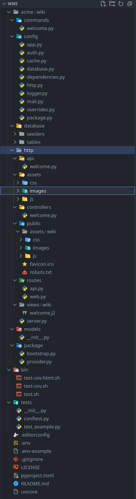

# Directory Structure

A fresh uvicore project called `acme.wiki` built with the [Uvicore Installer](installation.md) will have the following folder structure.



Uvicore is opinionated about structure so that every project feels familiar.  When you (or a teammate) open any Uvicore app, you already know where everything lives.  Remember the [Modular Concept](../deeper/modular.md), your package *is* the app, so this structure is all there is, no outer "shell" project wrapping it.

---

## The Package Root

At the top level you will find the entry points and project files:

| Path | Purpose |
|------|---------|
| `./uvicore` | The CLI entry point.  Run `./uvicore` to see your commands, `./uvicore http serve` to start the dev server. |
| `serve-uvicorn` / `serve-gunicorn` | Convenience scripts to serve the app in production with [Uvicorn or Gunicorn](../cli/python-entrypoints.md). |
| `.env` | Your environment-specific values.  Copied from `.env-example` at install. |
| `pyproject.toml` | Your package definition and dependencies (Poetry). |
| `tests/` | Your pytest suite. |
| `acme/wiki/` | Your actual Python package, everything below lives here. |

---

## Inside Your Package

Everything that makes your app *your app* lives under `acme/wiki/` (your chosen `vendor/package` namespace).

```text
acme/wiki/
  commands/          CLI command modules
  config/            All of your configuration files
  database/
    seeders/         Data seeders
    tables/          SQLAlchemy table definitions
  http/
    api/             API controllers
    controllers/     Web controllers
    public/          Browser-served files (favicon, robots.txt)
      assets/        Static CSS, JS and images
    routes/          web.py and api.py route registration
    views/           Jinja2 (.j2) templates
    server.py        The ASGI HTTP entry point
  models/            ORM models
  package/
    bootstrap.py     Bootstraps the app (CLI and HTTP entry points)
    provider.py      The Package Provider, your app's hub
```

### package/

The heart of your app.  `package/provider.py` is the [Package Provider](../deeper/provider.md) where you wire up everything your app offers, config, routes, models, commands and more.  `package/bootstrap.py` is the shared bootstrap used by both the CLI and HTTP entry points.

### config/

Your [configuration](configuration.md), split by concern for a great developer experience.  The two most important files are `config/package.py` (always applies) and `config/app.py` (applies only when your package is the running app).  The rest, `http.py`, `database.py`, `auth.py`, `cache.py`, `mail.py`, `logger.py`, `overrides.py`, `dependencies.py`, are imported into those two.

### commands/

Your async [CLI commands](../cli/writing-commands.md).  Each command is registered with the CLI from your provider.

### database/

Your [tables](../database/db-tables.md) and [seeders](../database/seeding.md).  Your [ORM models](../database/orm-basics.md) live one level up in `models/` since a model is a higher-level entity than a table.

### http/

Everything HTTP.  Web [routes](../http/web/routing.md) and [controllers](../http/web/controllers.md) render [views](../http/web/views.md); API [routes](../http/api/routing.md) and controllers return data.  Static files live in `public/` and `public/assets/`, and `server.py` is the ASGI app that Uvicorn/Gunicorn serve.

### models/

Your [ORM models](../database/orm-basics.md), the rich Python entities mapped to your database tables.

---

## Customizing Paths

These locations are the sensible defaults, but they are not rigid.  The `paths` section of your `config/package.py` lets you remap any of them (and is what the [`./uvicore gen`](../cli/built-in-commands.md) generators use to know where to place new files).

!!! tip
    Stick with the defaults unless you have a strong reason not to.  Consistent structure across Uvicore projects is a feature, it means every app, yours or a community package, reads the same way.
