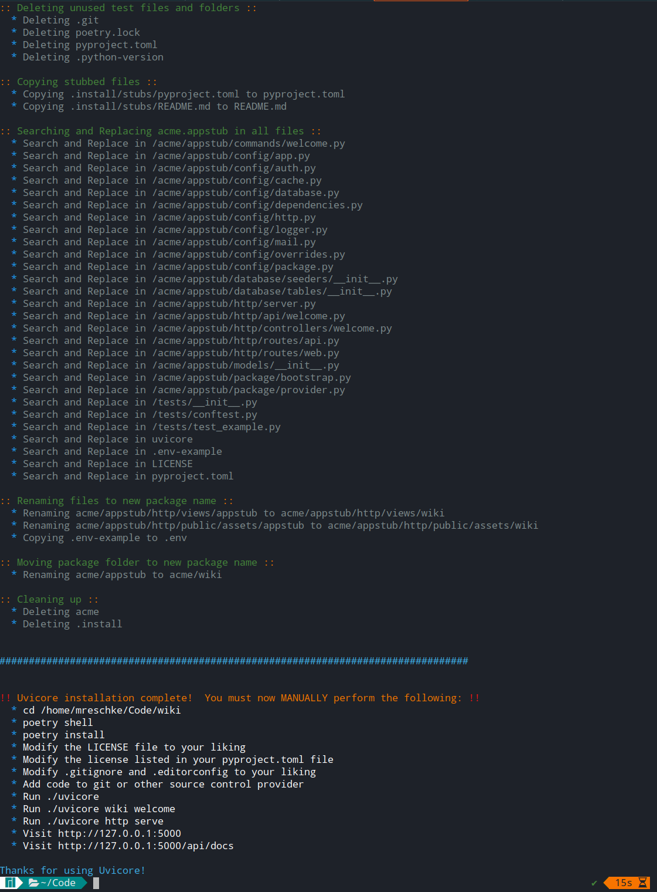
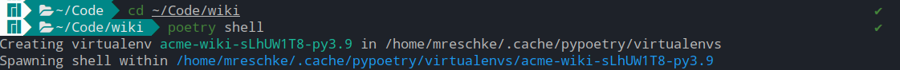
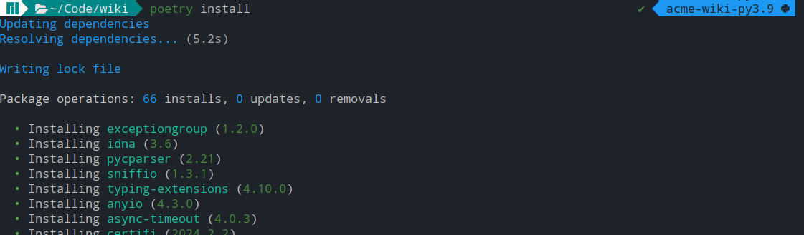
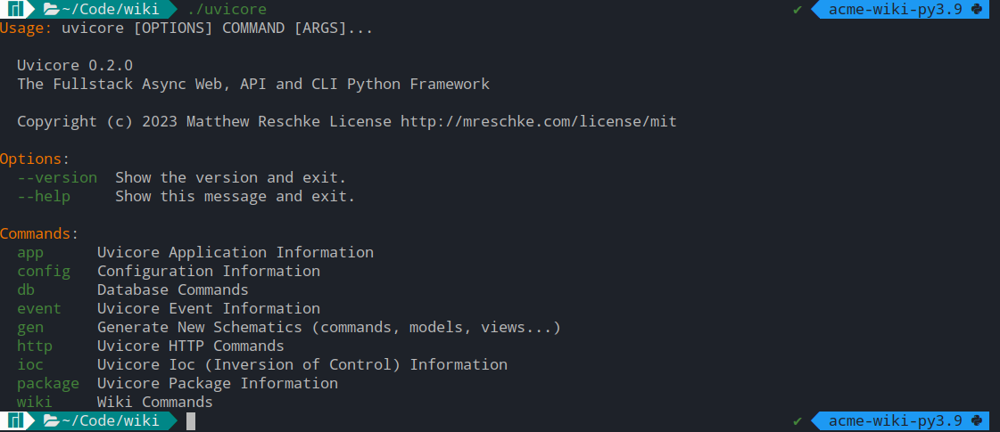
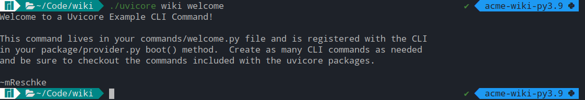
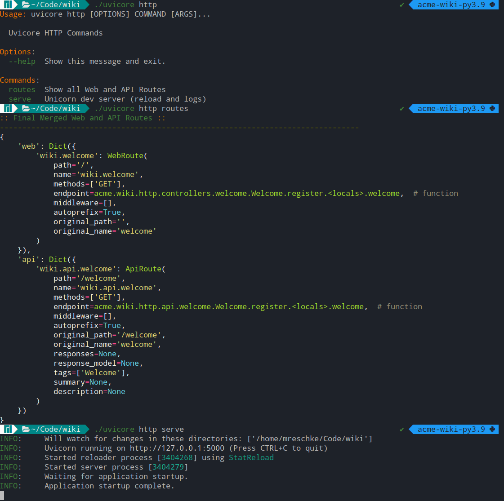
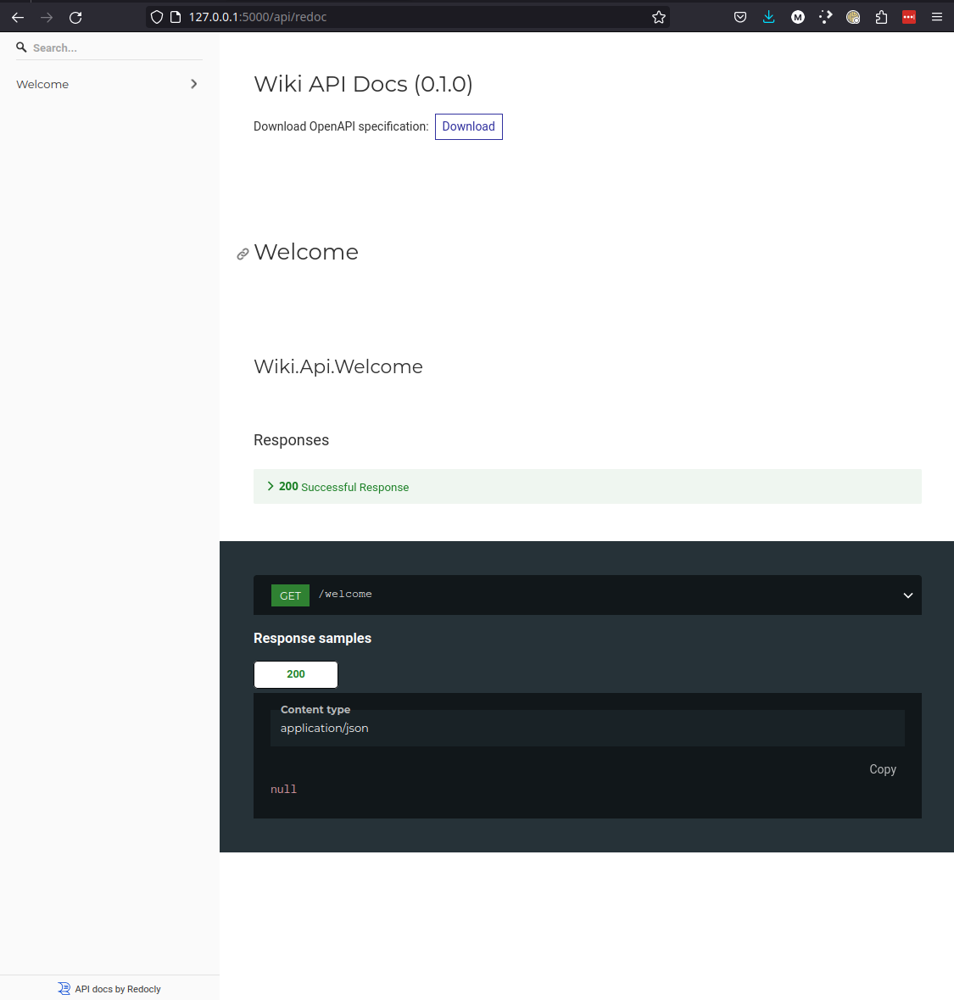

# Installation


## Up and Running in Seconds


---


## Download the uvicore-installer

```bash
cd ~
wget https://uvicore.io/uvicore-installer
chmod a+x uvicore-installer
sudo mv uvicore-installer /usr/local/bin
```

---


## Create your App
```bash
cd ~/Code
uvicore-installer wiki
```


---


## Load Your Virtualenv
```bash
cd ~/Code/wiki

# Create your virtual environment using your choice of env packages.
# poetry shell
# pipenv shell
# python -v venv env
# etc...
```


---


## Install Dependencies
```bash
# And install the packages using the same environment choice.
# poetry install
# pipenv install
# pip -r requirements.txt
# etc...
```


---


## Uvicore CLI

Run the `./uvicore` CLI to see all possible options
```bash
./uvicore
```


---


## Welcome CLI Example

Run your first `welcome` Async Click CLI stored in `./commands/welcome.py`

```bash
./uvicore wiki welcome
```


---


## Uvicore HTTP Server

Run the Uvicore HTTP Web/API Server

```bash
./uvicore http serve
```



## Show OpenAPI Docs

Visit the following

- [http://localhost:5000](http://localhost:5000)


- [http://localhost:5000/api/docs](http://localhost:5000/api/docs)


- [http://localhost:5000/api/redoc](http://localhost:5000/api/redoc)



